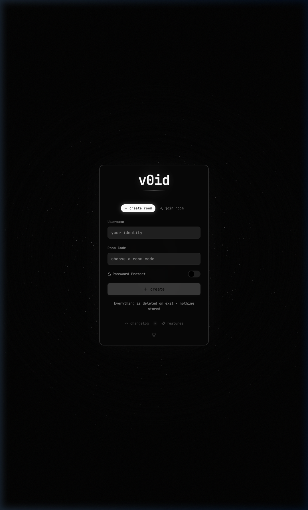

# V0ID Chat

A minimalist, account-free, ephemeral chat application. No sign-ups, no tracking, no data retention. Built for privacy and optimized for low-spec hardware.

**[Live →](https://v0id-chat.lovable.app)**

---

## Preview

| Join Screen | Chat View |
|:-----------:|:---------:|
|  |  |

---

## Features

- **No trace.** Messages, images, files — everything wipes after 10 minutes. No accounts, no logs.
- **Full chat UX.** Real-time chat, typing indicators, read receipts, edit/unsend, threads, and reactions.
- **Media support.** Drag & drop attachments, image previewing, and built-in b/w Klipy GIF search.
- **Void Aesthetic.** Strictly b/w design. Native dark mode, adjustable UI scale, and interactive 404 galaxy background.
- **Admin Terminal.** Type `/admin` to freeze chat, nuke the room, kick users, or broadcast messages.
- **Anti-screenshot.** Room instantly alerts if someone screenshots the chat on mobile.

---

## Tech Stack

| Layer | Technology |
|-------|-----------|
| Frontend | React, TypeScript, Vite |
| Styling | Tailwind CSS, shadcn/ui |
| Animation | Framer Motion |
| Realtime | Supabase Realtime (WebSocket) |
| Storage | Supabase Storage (auto-purged) |
| Backend | Supabase Edge Functions |
| GIFs | Klipy API |

---

## Getting Started

```bash
# Install dependencies
npm install

# Start dev server
npm run dev

## License

MIT
